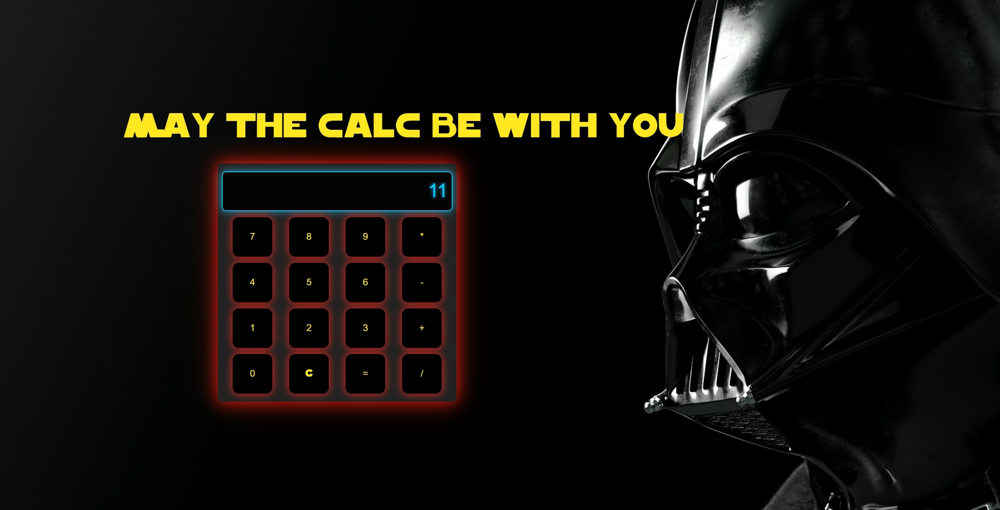

# ⭐ Calculadora Star Wars – Vanilla JS

¡Bienvenido a la Calculadora de Star Wars!

Esta es una **calculadora temática inspirada en el universo de Star Wars**, desarrollada con **HTML, CSS y JavaScript puro (Vanilla JS)**. Es una práctica divertida y educativa para mejorar habilidades en **manipulación del DOM**, eventos y lógica de programación básica.

## 🚀 Características

- Diseño visual inspirado en Star Wars (colores, tipografía y detalles temáticos).
- Operaciones básicas: suma, resta, multiplicación y división.
- Interfaz responsiva y visualmente atractiva.
- Interacción completamente gestionada mediante JavaScript puro.
- Ideal como proyecto de práctica para principiantes que quieren mejorar en DOM y JS sin frameworks.

## 🧠 ¿Por qué es útil?

Este proyecto es una **excelente práctica para desarrollar habilidades en JavaScript puro**, especialmente en:

- Manejo de eventos (`addEventListener`)
- Acceso y modificación del DOM (`querySelector`, `innerText`, `classList`, etc.)
- Control de flujo con condiciones y funciones
- Separación de lógica y presentación
- Estilización creativa usando CSS para reforzar una temática

## 📸 Vista previa

## 🛠️ Tecnologías utilizadas

- HTML5
- CSS3
- JavaScript (Vanilla JS)
